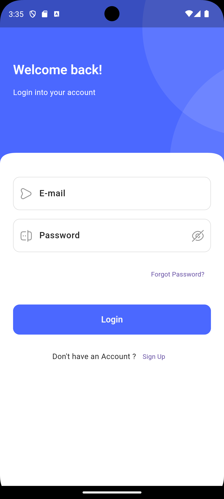
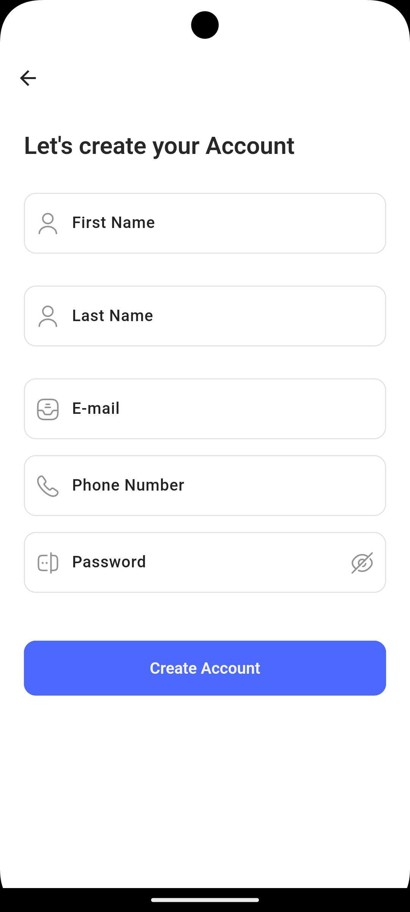
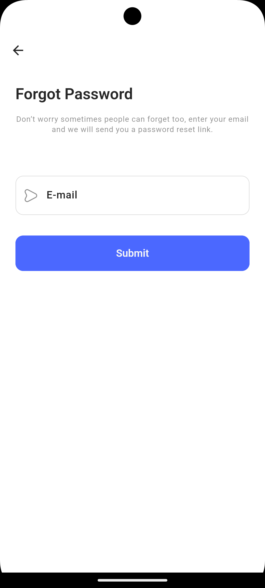
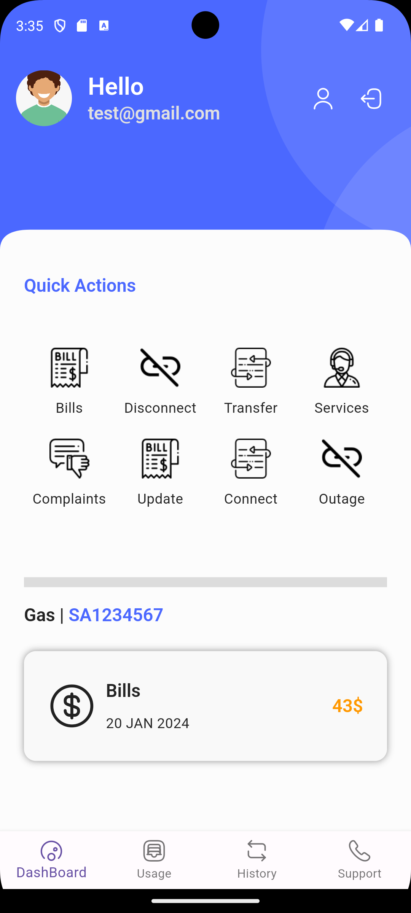

# BynryApp

Redesigned the app UI/UX with backend for authentication which involves validation and exception handling.

## Table of Contents

- [Installation](#installation)

## Installation

1. Download the zip file from GitHub.
2. Open the project in Visual Studio Code.
3. On the terminal, enter this command: flutter pub get
4. This will install all the necessary dependencies.
5. Run the app.

## Screen Shots

## License

This project is licensed under the [MIT License](LICENSE). You can find the license file [here](LICENSE).
